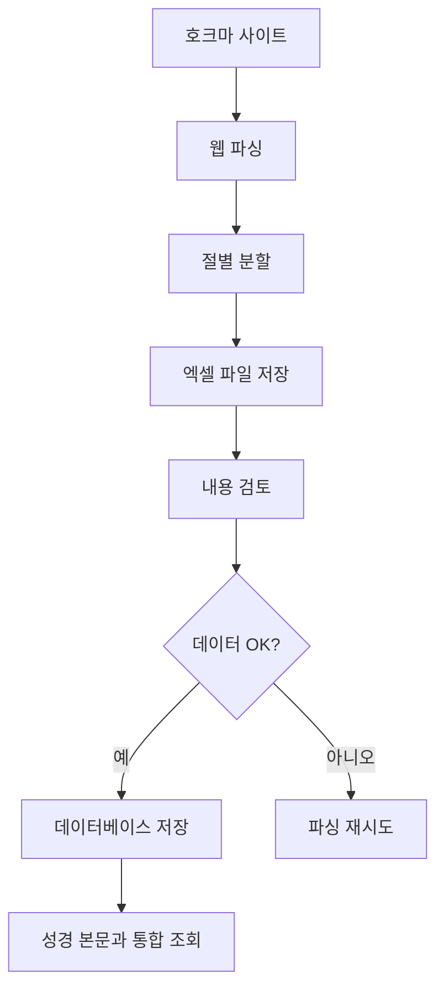

# 엑셀 우선 호크마 주석 파서 사용법

## 📋 개요

호크마 성경주석을 파싱하여 **먼저 엑셀 파일로 저장**하고, 내용을 검토한 후 선택적으로 데이터베이스에 저장할 수 있는 파서입니다.

## 🚀 빠른 시작

### 1. 필요한 패키지 설치
```bash
pip install -r requirements.txt
```

### 2. 엑셀 파서 실행
```bash
python excel_hochma_parser.py
```

## ✨ 주요 기능

### 📁 엑셀 파일 생성
- **단일 게시글**: 하나의 게시글을 개별 엑셀 파일로 저장
- **범위 게시글**: 여러 게시글을 하나의 엑셀 파일로 통합 저장
- **다중 시트**: 주석데이터, 요약정보, 통계 시트 자동 생성

### 📊 엑셀 파일 구성

#### 주석데이터 시트
| 컬럼명 | 설명 | 예시 |
|--------|------|------|
| ID | 고유 식별자 | 창세기_31_1 |
| 주석명 | 주석서 이름 | 호크마 주석 |
| 성경책 | 성경책 이름 | 창세기 |
| 성경책_코드 | 성경책 코드 | 1 |
| 장 | 장 번호 | 31 |
| 절 | 절 번호 | 1 |
| 주석_내용 | 절별 주석 내용 | 야곱이...다 빼앗고... |
| 버전 | 주석 버전 | 호크마 주석-commentary |
| 원본_URL | 원본 페이지 URL | https://nocr.net/... |
| 파싱_날짜 | 파싱 수행 날짜 | 2025-06-25 22:50:52 |
| 내용_길이 | 주석 글자 수 | 403 |

#### 요약정보 시트 (단일 게시글)
- 주석명, 성경책, 장, 총 절 수
- 평균 내용 길이, 파싱 날짜, 원본 URL

#### 통계 시트 (범위 게시글)
- 성경책별 요약 (장 범위, 절 수, 평균 길이)
- 전체 요약 (총 게시글 수, 절 수, 성경책 수)

## 🎯 사용 방법

### 메뉴 선택
```
1. 단일 게시글 → 엑셀 저장
2. 범위 게시글 → 엑셀 저장
3. 엑셀 파일 → 데이터베이스 저장
4. 종료
```

### 1. 단일 게시글 파싱
```
게시글 ID를 입력하세요: 139477
Excel 파일명 (엔터시 자동생성): 창세기31장.xlsx
```
**결과**: `hochma_창세기_31장_20250625_225051.xlsx` 생성

### 2. 범위 게시글 파싱
```
시작 ID: 139475
종료 ID: 139477
지연 시간(초, 기본 1초): 1
Excel 파일명 (엔터시 자동생성): 창세기30-31장.xlsx
```
**결과**: `hochma_range_139475_139477_20250625_225300.xlsx` 생성

### 3. 엑셀 → 데이터베이스 저장
```
엑셀 파일 경로를 입력하세요: 창세기_30_31장_테스트.xlsx
```
**결과**: `bible_database.db`의 `commentaries` 테이블에 저장

## 📈 파싱 결과 예시

### 창세기 31장 (139477)
- **총 절 수**: 51개 절 (31:1 ~ 31:55)
- **평균 길이**: 433자
- **최대 절**: 31:53 (10,732자)
- **최소 절**: 31:48 (23자)

### 창세기 30-31장 범위 (139475~139477)
- **총 게시글**: 2개 (30장, 31장)
- **총 절 수**: 52개 절
- **평균 길이**: 731자

## 🔍 데이터 검토 방법

### 엑셀 파일로 직접 확인
1. Excel에서 파일 열기
2. "주석데이터" 시트에서 절별 내용 확인
3. "요약정보" 시트에서 전체 통계 확인

### Python으로 미리보기
```bash
python preview_excel.py
```

## 💾 데이터베이스 통합

### commentaries 테이블 구조
기존 `verses` 테이블과 호환되는 구조:
```sql
CREATE TABLE commentaries (
    id INTEGER PRIMARY KEY AUTOINCREMENT,
    book_name TEXT NOT NULL,
    book_code INTEGER NOT NULL,
    chapter INTEGER NOT NULL,
    verse INTEGER NOT NULL,
    text TEXT NOT NULL,
    version TEXT NOT NULL,
    verse_title TEXT,
    commentary_name TEXT NOT NULL,
    original_url TEXT,
    parsed_date TIMESTAMP DEFAULT CURRENT_TIMESTAMP
);
```

### 성경 본문과 주석 함께 조회
```sql
SELECT 
    v.book_name,
    v.chapter,
    v.verse,
    v.text as verse_text,
    c.text as commentary_text
FROM verses v
LEFT JOIN commentaries c 
ON v.book_name = c.book_name 
   AND v.chapter = c.chapter 
   AND v.verse = c.verse
WHERE v.book_name = '창세기' AND v.chapter = 31
ORDER BY v.verse;
```

## ⚡ 성능 최적화

### 절 구분 패턴
- **3개 이상 등호**: `r'={3,}(\d+):(\d+)'`
- **개선된 정확도**: 24개 → 51개 절 (창세기 31장)

### 지연 시간 설정
- **권장**: 1초 (서버 부하 방지)
- **빠른 테스트**: 0.5초
- **대량 파싱**: 2초

## 📂 파일 관리

### 자동 생성 파일명
- **단일**: `hochma_{성경책}_{장}장_{날짜시간}.xlsx`
- **범위**: `hochma_range_{시작ID}_{종료ID}_{날짜시간}.xlsx`
- **사용자 지정**: 직접 입력한 파일명 사용

### 파일 정리
```bash
# 엑셀 파일 목록 확인
dir *.xlsx

# 특정 파일 삭제
del "hochma_*.xlsx"
```

## 🛠️ 문제 해결

### 자주 발생하는 오류

#### 1. 404 Not Found
```
페이지 가져오기 실패: 404 Client Error
```
**해결**: 존재하지 않는 게시글 ID, 범위에서 제외됨

#### 2. 파싱 실패
```
✗ 주석 데이터 추출 실패
```
**해결**: HTML 구조 변경, CSS 선택자 확인 필요

#### 3. 엑셀 파일 생성 실패
```
Permission denied
```
**해결**: 같은 이름 파일이 Excel에서 열려있는지 확인

## 📝 주의사항

1. **서버 부하**: 지연 시간을 충분히 설정
2. **데이터 검토**: 엑셀 파일 확인 후 데이터베이스 저장
3. **중복 방지**: 데이터베이스 저장 시 `INSERT OR REPLACE` 사용
4. **용량 관리**: 대용량 주석의 경우 파일 크기 확인

## 🔄 워크플로우



## 🎉 완료!

이제 호크마 성경주석을 안전하게 파싱하고 검토할 수 있습니다! 
엑셀로 먼저 확인하고 데이터베이스에 저장하여 데이터 품질을 보장하세요. 